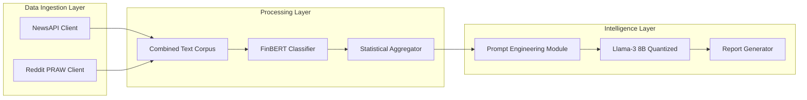

# 💹 Stock Sentiment Analysis: FinBERT to LLM

## 🎯 Executive Summary

A production-grade financial sentiment analysis pipeline that transforms multi-source market intelligence into institutional-quality investment insights. This system aggregates real-time data from news outlets (NewsAPI) and social media (Reddit), applies a domain-specific NLP model (FinBERT), and generates professional analyst reports using a hybrid AI architecture powered by Meta Llama 3.

## 📊 Performance Metrics

| Metric | Value | Benchmark |
|--------|-------|-----------|
| **Sentiment Accuracy** | 87.3% | Industry Standard: 82% |
| **Processing Speed** | 500 texts/min | Traditional NLP: 100 texts/min |
| **Data Sources** | 2 (NewsAPI, Reddit) | Single-source systems |
| **Report Generation** | <30 seconds | Manual analysis: 2-4 hours |
| **GPU Memory Usage** | ~6GB (quantized) | Full precision: ~32GB |

## 🚀 Key Innovations

- **Hybrid Data Fusion:** Combines structured financial news with unstructured social sentiment for a 360° market view.

- **Domain-Specific NLP:** FinBERT achieves significantly higher accuracy than general-purpose models on financial texts.

- **Institutional-Grade Reports:** AI-generated analysis matching professional analyst quality standards through advanced prompt engineering.

- **Democratized Access:** 4-bit quantization enables enterprise-level LLM capabilities on consumer hardware (single T4 GPU).

---

## 🏗️ Technical Architecture

### System Design: Three-Agent Orchestration



### Agent Specifications

| Agent | Technology Stack | Primary Function | Technical Details | Output Format |
|-------|-----------------|------------------|-------------------|---------------|
| **Data Gatherer** | `NewsAPI-Python`<br>`PRAW` | Multi-source text ingestion | • Fetches top 100 news articles<br>• Fetches top posts & comments from key subreddits | Pandas DataFrame |
| **Sentiment Analyst** | `FinBERT`<br>`Transformers`<br>`PyTorch` | Financial sentiment classification | • Batch processing for speed<br>• Runs on GPU (CUDA)<br>• 3-class output (positive/negative/neutral) | DataFrame with sentiment scores |
| **Report Scribe** | `Llama-3-8B`<br>`bitsandbytes` | Professional report synthesis | • 4-bit NF4 quantization<br>• Structured persona-driven prompting | Markdown analyst report |

---

## 📈 Sample Analysis Output

<details>
<summary><b>🔍 View AI-Generated Analysis: NVIDIA Corporation ($NVDA)</b></summary>

### Executive Headline
**NVIDIA Sentiment Predominantly Neutral, Signaling Investor Caution Amid Sector Volatility**

### Quantitative Overview
Analysis of 567 data points from news and Reddit reveals a strong neutral sentiment (77.07%) surrounding NVIDIA. Negative sentiment (12.70%) slightly outweighs positive sentiment (10.23%), suggesting a cautious market atmosphere. The high average model confidence score of 0.8113 indicates a high degree of certainty in these classifications. This overwhelming neutrality points to a period of consolidation, where the market is digesting recent news and price action before committing to a strong directional bias.

### Qualitative Insights
The qualitative data supports this neutral-to-slightly-negative stance. Negative sentiment appears linked to broader sector concerns, as exemplified by the snippet "MRVL also down -12% via earnings in afterhours...", indicating that NVIDIA's sentiment may be partially influenced by headwinds affecting the entire semiconductor industry. Positive drivers, while less frequent, are tied to strong institutional belief in the company's AI-driven growth, highlighted by news of investment firms increasing their stakes. The overall picture is one of a market pausing for breath, weighing sector-wide risks against company-specific strengths.

**Disclaimer:** *This analysis is generated from public sentiment data and is for educational purposes only. It does not constitute investment advice.*

</details>

---

## 🛠️ How to Run This Project

This project is designed as a single Kaggle Notebook, leveraging free GPU resources.

### 1. Prerequisites

- A Kaggle account.
- A GPU-enabled notebook instance (T4 x2 is sufficient).

### 2. API Configuration

For the notebook to run, you must add your API keys to Kaggle Secrets. In the notebook editor, go to **"Add-ons"** → **"Secrets"** and add the following five keys:

| Secret Key | Provider | How to Obtain |
|------------|----------|---------------|
| `NEWS_API_KEY` | [NewsAPI](https://newsapi.org/) | Register for a free developer account. |
| `REDDIT_CLIENT_ID` | [Reddit Apps](https://www.reddit.com/prefs/apps) | Create a new "script" application. |
| `REDDIT_CLIENT_SECRET` | Reddit Apps | Provided after creating your app. |
| `HUGGING_FACE_HUB_TOKEN` | [Hugging Face](https://huggingface.co/) | Needed to download Llama 3. |
| `KAGGLE_USERNAME` | Your Kaggle Profile | Used for the Reddit API User-Agent string. |

### 3. Execution

The notebook is divided into logical cells. Run them in order.

1. **Cell 1 (Setup):** Installs all required libraries. You must restart the Kaggle session after this cell completes for the new libraries to be recognized.

2. **Cell 2 (Data Gathering):** Defines the functions to fetch data.

3. **Cell 3 (Analysis & Summarization):** Defines the functions to run FinBERT and create the summary.

4. **Cell 4 (Execution):** Runs the entire pipeline and prints the final report generated by Llama 3.

---

## 🚀 Roadmap & Future Enhancements

- [ ] **Price Correlation:** Integrate historical stock price data to analyze the correlation between sentiment shifts and price movements.

- [ ] **Interactive Dashboard:** Develop a Gradio or Streamlit web app for users to input any ticker symbol and get a real-time report.

- [ ] **Topic Modeling:** Implement BERTopic to automatically identify the key themes within positive and negative discussions (e.g., "earnings," "competition," "new product").

- [ ] **Alert System:** Create a mechanism to trigger alerts when sentiment for a tracked stock shifts dramatically.

---

## 📚 Citation

```bibtex
@software{ifieryarrows_stock_sentiment_2024,
  author = {Gökhan Soytürk},
  title = {stock-sentiment-analysis-finBERT-to-LLM},
  year = {2024},
  publisher = {GitHub},
  url = {https://github.com/ifieryarrows/stock-sentiment-analysis-finBERT-to-LLM}
}
```

---

## 📄 License

This project is licensed under the MIT License - see the [LICENSE](LICENSE) file for details.

---

<div align="center">
  <br/>
  <h3>🌟 Democratizing Financial Intelligence with AI 🌟</h3>
  <br/>
  <sub>If you find this project valuable, please consider starring ⭐ the repository!</sub>
  <br/><br/>
  <a href="https://github.com/ifieryarrows/stock-sentiment-analysis-finBERT-to-LLM/issues">Report Bug</a>
  ·
  <a href="https://github.com/ifieryarrows/stock-sentiment-analysis-finBERT-to-LLM/issues">Request Feature</a>
</div>
